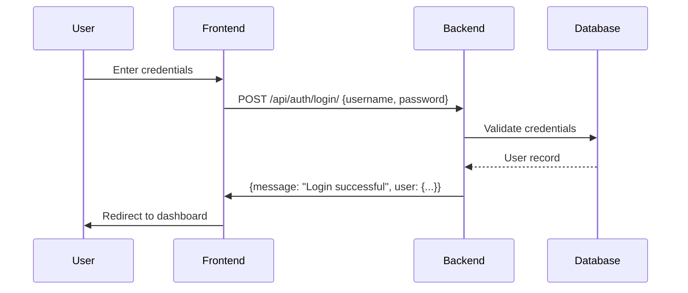
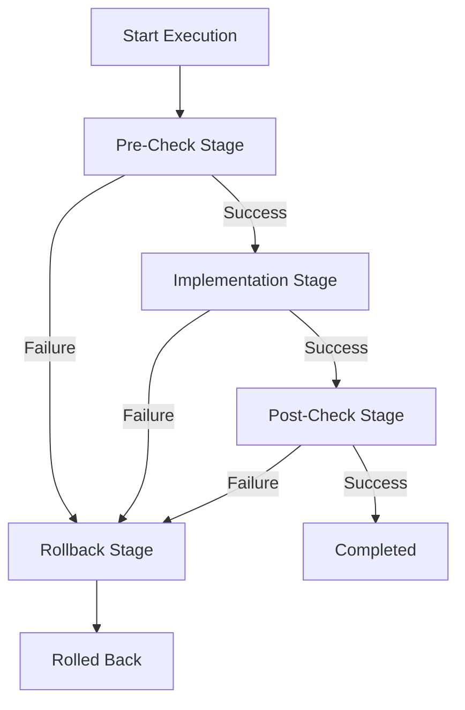

# Network Automation Tool - Comprehensive Documentation

## Table of Contents

1. [Introduction](#introduction)
2. [System Architecture](#system-architecture)
3. [Authentication and Authorization](#authentication-and-authorization)
4. [Device Management](#device-management)
5. [Workflow Management](#workflow-management)
6. [Workflow Execution](#workflow-execution)
7. [Webhook Configurations](#webhook-configurations)
8. [Execution Monitoring and Logs](#execution-monitoring-and-logs)
9. [API Reference](#api-reference)
10. [User Interface Guide](#user-interface-guide)
11. [Technical Implementation Details](#technical-implementation-details)
12. [Troubleshooting](#troubleshooting)

## Introduction

The Network Automation Tool is a comprehensive platform for automating network device management tasks. It provides a web-based interface for creating, managing, and executing automation workflows on network devices.

### Key Features

- **Device Management**: Add, view, and manage network devices
- **Workflow Creation**: Design multi-stage automation workflows with pre-checks, implementation, post-checks, and rollback capabilities
- **Workflow Execution**: Execute workflows on specific devices with real-time monitoring
- **Webhook Integration**: Configure webhooks for event notifications
- **Execution Monitoring**: Track workflow execution status and results
- **Comprehensive Logging**: System-wide logging for auditing and troubleshooting
- **Dynamic Parameter Support**: Customize workflow execution with runtime parameters

## System Architecture

The application follows a client-server architecture with:

- **Frontend**: React.js web application with responsive UI
- **Backend**: Django REST API with Celery for asynchronous task processing
- **Database**: MariaDB-compatible database for data persistence
- **Authentication**: Session-based authentication with CSRF protection

### Component Overview

```
┌───────────────────────────────────────────────────────────────┐
│                        FRONTEND (React)                       │
│  ┌─────────────┐  ┌─────────────┐  ┌───────────────────────┐  │
│  │  Dashboard  │  │  Devices    │  │  Workflows           │  │
│  └─────────────┘  └─────────────┘  └───────────────────────┘  │
│  ┌─────────────┐  ┌─────────────┐  ┌───────────────────────┐  │
│  │ Executions  │  │  Logs       │  │  Webhook Configs     │  │
│  └─────────────┘  └─────────────┘  └───────────────────────┘  │
└───────────────────────────────────────────────────────────────┘
                            │
                            ▼
┌───────────────────────────────────────────────────────────────┐
│                        BACKEND (Django)                       │
│  ┌─────────────┐  ┌─────────────┐  ┌───────────────────────┐  │
│  │  API Views  │  │  Models     │  │  Celery Tasks        │  │
│  └─────────────┘  └─────────────┘  └───────────────────────┘  │
│  ┌─────────────┐  ┌─────────────┐  ┌───────────────────────┐  │
│  │ Auth Views  │  │  Webhooks   │  │  SSH Utilities       │  │
│  └─────────────┘  └─────────────┘  └───────────────────────┘  │
└───────────────────────────────────────────────────────────────┘
                            │
                            ▼
┌───────────────────────────────────────────────────────────────┐
│                        DATABASE (MariaDB)                     │
│  ┌─────────────┐  ┌─────────────┐  ┌───────────────────────┐  │
│  │  Devices    │  │  Workflows  │  │  Workflow Executions │  │
│  └─────────────┘  └─────────────┘  └───────────────────────┘  │
│  ┌─────────────┐  ┌─────────────┐  ┌───────────────────────┐  │
│  │ Command Exec│  │  System Logs│  │  Webhook Configs     │  │
│  └─────────────┘  └─────────────┘  └───────────────────────┘  │
└───────────────────────────────────────────────────────────────┘
```

## Authentication and Authorization

### Login Process

1. **Access the Login Page**: Navigate to `/login`
2. **Enter Credentials**: Provide username and password
3. **Authentication**: System validates credentials against Django's authentication backend
4. **Session Creation**: Successful login creates a session with CSRF token

### API Authentication Flow



### Session Management

- **CSRF Protection**: All authenticated requests require CSRF token
- **Session Timeout**: Configured in Django settings
- **Logout**: POST request to `/api/auth/logout/` terminates session

## Device Management

### Device Model Structure

| Field | Type | Description |
|-------|------|-------------|
| `id` | UUID | Unique device identifier |
| `name` | String | Device name (unique) |
| `hostname` | String | Device hostname |
| `ip_address` | IP Address | Device IP address |
| `device_type` | Enum | Router, Switch, Firewall, etc. |
| `status` | Enum | Online, Offline, Maintenance, Unknown |
| `ssh_port` | Integer | SSH port (default: 22) |
| `vendor` | String | Device vendor |
| `model` | String | Device model |
| `os_version` | String | Operating system version |
| `location` | String | Physical location |
| `description` | Text | Additional notes |

### Device Operations

#### Create Device
- **UI Path**: `/devices/create`
- **API Endpoint**: `POST /api/devices/`
- **Required Fields**: `name`, `hostname`, `ip_address`, `username`, `password`
- **Optional Fields**: `device_type`, `ssh_port`, `enable_password`, `vendor`, `model`, `os_version`, `location`, `description`

#### List Devices
- **UI Path**: `/devices`
- **API Endpoint**: `GET /api/devices/`
- **Features**: Pagination, filtering, sorting
- **Response**: Array of device objects with metadata

#### Device Grouping
- **UI Path**: `/device-mapping`
- **API Endpoint**: `GET /api/devices/grouping/`
- **Functionality**: Groups devices by model/version/OS for bulk operations

## Workflow Management

### Workflow Model Structure

| Field | Type | Description |
|-------|------|-------------|
| `id` | UUID | Unique workflow identifier |
| `name` | String | Workflow name (unique) |
| `description` | Text | Workflow description |
| `status` | Enum | Draft, Active, Paused, Archived |
| `pre_check_commands` | JSON | Commands to run before implementation |
| `implementation_commands` | JSON | Main automation commands |
| `post_check_commands` | JSON | Commands to run after implementation |
| `rollback_commands` | JSON | Commands to revert changes |
| `validation_rules` | JSON | Rules for command output validation |

### Command Structure

Each command in the workflow can be:
- **Simple string**: `"show version"`
- **Object with validation**:
  ```json
  {
    "command": "show interface status",
    "regex_pattern": "connected",
    "operator": "contains"
  }
  ```

### Workflow Operations

#### Create Workflow
- **UI Path**: `/workflows/create`
- **API Endpoint**: `POST /api/workflows/`
- **Required Fields**: `name`, `description`
- **Optional Fields**: `status`, `pre_check_commands`, `implementation_commands`, `post_check_commands`, `rollback_commands`, `validation_rules`

#### List Workflows
- **UI Path**: `/workflows`
- **API Endpoint**: `GET /api/workflows/`
- **Features**: Pagination, filtering by status, command counts

#### View Workflow Details
- **UI Path**: `/workflows/:id`
- **API Endpoint**: `GET /api/workflows/:id/`
- **Response**: Full workflow details including all command stages

#### Update Workflow
- **UI Path**: `/workflows/:id/edit`
- **API Endpoint**: `PUT /api/workflows/:id/`
- **Functionality**: Update any workflow field

## Workflow Execution

### Execution Model Structure

| Field | Type | Description |
|-------|------|-------------|
| `id` | UUID | Unique execution identifier |
| `workflow` | ForeignKey | Associated workflow |
| `device` | ForeignKey | Target device |
| `status` | Enum | Pending, Running, Completed, Failed, Cancelled, Rolling Back, Rolled Back |
| `current_stage` | Enum | Pre-Check, Implementation, Post-Check, Rollback, Completed |
| `started_at` | DateTime | Execution start time |
| `completed_at` | DateTime | Execution end time |
| `error_message` | Text | Error details if failed |
| `dynamic_params` | JSON | Runtime parameters for execution |

### Execution Process Flow



### Execute Workflow

- **UI Path**: `/workflows/execute`
- **API Endpoint**: `POST /api/workflows/execute/`
- **Required Fields**: `workflow_id`, `device_id`
- **Optional Fields**: `dynamic_params` (for runtime customization)

### Dynamic Parameters

Dynamic parameters allow customization of workflow execution:

```json
{
  "workflow_id": "123e4567-e89b-12d3-a456-426614174000",
  "device_id": "789e4567-e89b-12d3-a456-426614174000",
  "dynamic_params": {
    "show interface status": "GigabitEthernet0/1",
    "configure terminal": "description Automated Configuration"
  }
}
```

### Execution Monitoring

- **UI Path**: `/executions` (list), `/executions/:id` (details)
- **API Endpoint**: `GET /api/executions/` (list), `GET /api/executions/:id/` (details)
- **Features**: Real-time status updates, command output viewing, error analysis

## Webhook Configurations

### Webhook Model Structure

| Field | Type | Description |
|-------|------|-------------|
| `id` | UUID | Unique webhook identifier |
| `name` | String | Webhook name (unique) |
| `description` | Text | Webhook description |
| `webhook_url` | URL | URL to send notifications |
| `events` | Enum | execution_completed, execution_failed, execution_started, all_events |
| `method` | Enum | POST, PUT |
| `is_active` | Boolean | Whether webhook is active |
| `secret_key` | String | Optional secret for verification |

### Webhook Operations

#### Create Webhook
- **UI Path**: `/webhooks` (create form)
- **API Endpoint**: `POST /api/webhooks/`
- **Required Fields**: `name`, `webhook_url`
- **Optional Fields**: `description`, `events`, `method`, `is_active`, `secret_key`

#### List Webhooks
- **UI Path**: `/webhooks`
- **API Endpoint**: `GET /api/webhooks/`
- **Features**: View all configured webhooks with status

#### Update Webhook
- **UI Path**: `/webhooks` (edit form)
- **API Endpoint**: `PUT /api/webhooks/:id/`
- **Functionality**: Update any webhook field

#### Delete Webhook
- **UI Path**: `/webhooks` (delete action)
- **API Endpoint**: `DELETE /api/webhooks/:id/`

#### Test Webhook
- **UI Path**: `/webhooks` (test action)
- **API Endpoint**: `POST /api/webhooks/:id/test/`

### Webhook Event Types

| Event | Description | Trigger Condition |
|-------|-------------|-------------------|
| `execution_completed` | Workflow execution completed successfully | Status changes to "completed" |
| `execution_failed` | Workflow execution failed | Status changes to "failed" |
| `execution_started` | Workflow execution started | Status changes to "running" |
| `all_events` | All execution events | Any status change |

## Execution Monitoring and Logs

### Execution Monitoring Features

- **Real-time Status**: View current execution stage and status
- **Command Output**: Detailed output for each command executed
- **Validation Results**: Results of command output validation
- **Error Analysis**: Detailed error messages and stack traces
- **Timeline**: Execution timeline with stage durations

### System Logging

- **Log Types**: System, Authentication, Device, Workflow, Configuration, TACACS
- **Log Levels**: INFO, WARNING, ERROR, DEBUG, AUDIT
- **Features**: Filtering, searching, detailed diff views for changes

#### View Logs
- **UI Path**: `/logs`
- **API Endpoint**: `GET /api/logs/`
- **Features**: Pagination, filtering by level/type, search functionality

#### Log Details
- **UI Path**: `/logs/:id`
- **API Endpoint**: `GET /api/logs/:id/`
- **Features**: Full log details with change diff visualization

## API Reference

### Authentication Endpoints

| Endpoint | Method | Description | Parameters |
|----------|--------|-------------|------------|
| `/api/auth/login/` | POST | User login | `username`, `password` |
| `/api/auth/logout/` | POST | User logout | - |
| `/api/auth/user/` | GET | Get current user | - |
| `/api/auth/csrf/` | GET | Get CSRF token | - |

### Device Endpoints

| Endpoint | Method | Description | Parameters |
|----------|--------|-------------|------------|
| `/api/devices/` | GET | List all devices | `page`, `per_page` |
| `/api/devices/` | POST | Create device | Device object |
| `/api/devices/grouping/` | GET | Get device groupings | - |

### Workflow Endpoints

| Endpoint | Method | Description | Parameters |
|----------|--------|-------------|------------|
| `/api/workflows/` | GET | List all workflows | - |
| `/api/workflows/` | POST | Create workflow | Workflow object |
| `/api/workflows/:id/` | GET | Get workflow details | - |
| `/api/workflows/:id/` | PUT | Update workflow | Workflow object |
| `/api/workflows/execute/` | POST | Execute workflow | `workflow_id`, `device_id`, `dynamic_params` |

### Execution Endpoints

| Endpoint | Method | Description | Parameters |
|----------|--------|-------------|------------|
| `/api/executions/` | GET | List executions | `status`, `workflow_id`, `device_id`, `page`, `per_page` |
| `/api/executions/:id/` | GET | Get execution details | - |

### Webhook Endpoints

| Endpoint | Method | Description | Parameters |
|----------|--------|-------------|------------|
| `/api/webhooks/` | GET | List webhooks | - |
| `/api/webhooks/` | POST | Create webhook | Webhook object |
| `/api/webhooks/:id/` | GET | Get webhook details | - |
| `/api/webhooks/:id/` | PUT | Update webhook | Webhook object |
| `/api/webhooks/:id/` | DELETE | Delete webhook | - |
| `/api/webhooks/:id/test/` | POST | Test webhook | - |

### Log Endpoints

| Endpoint | Method | Description | Parameters |
|----------|--------|-------------|------------|
| `/api/logs/` | GET | List logs | `level`, `type`, `object_type`, `search`, `page`, `per_page` |
| `/api/logs/:id/` | GET | Get log details | - |

## User Interface Guide

### Navigation Structure

```
┌───────────────────────────────────────────────────────────────┐
│  NETWORK AUTOMATION TOOL                                      │
├───────────────────────────────────────────────────────────────┤
│  Dashboard │ Devices │ Workflows │ Executions │ Logs │ Webhooks│
├───────────────────────────────────────────────────────────────┤
│                                                               │
│  [Main Content Area]                                         │
│                                                               │
│  - Device Management: Add, view, group devices               │
│  - Workflow Management: Create, edit, execute workflows      │
│  - Execution Monitoring: Track workflow executions           │
│  - System Logs: View and analyze system events               │
│  - Webhook Configuration: Manage event notifications         │
│                                                               │
└───────────────────────────────────────────────────────────────┘
```

### Dashboard Overview

The dashboard provides a comprehensive overview of the system:

- **Device Statistics**: Total devices, online/offline status
- **Workflow Statistics**: Total workflows, active/draft status
- **Recent Executions**: Latest workflow executions with status
- **System Health**: Overall system status and metrics

### Device Management Interface

**Devices Page (`/devices`)**:
- List view with pagination and filtering
- Device status indicators
- Quick actions: View details, edit, delete
- Bulk operations: Group assignment, workflow execution

**Create Device Page (`/devices/create`)**:
- Form with all device fields
- Validation for required fields
- Device type selection
- Connection testing

### Workflow Management Interface

**Workflows Page (`/workflows`)**:
- List view with workflow status
- Command counts for each stage
- Quick actions: View, edit, execute, archive
- Search and filtering capabilities

**Create Workflow Page (`/workflows/create`)**:
- Multi-stage form for workflow definition
- Command editor with validation rules
- Preview functionality
- Save as draft or publish

**Workflow View Page (`/workflows/:id`)**:
- Detailed workflow information
- Stage-by-stage command listing
- Validation rules display
- Execution history

### Execution Monitoring Interface

**Executions Page (`/executions`)**:
- List of all executions with status
- Filtering by workflow, device, status
- Real-time status updates
- Quick access to execution details

**Execution Detail Page (`/executions/:id`)**:
- Execution timeline
- Stage-by-stage results
- Command output and validation
- Error analysis
- Rollback information

### Webhook Configuration Interface

**Webhook Configurations Page (`/webhooks`)**:
- List of configured webhooks
- Status indicators (active/inactive)
- Quick actions: Edit, test, delete
- Create new webhook form

## Technical Implementation Details

### Backend Architecture

- **Framework**: Django 3.x/4.x
- **Database**: MariaDB-compatible (MySQL, PostgreSQL)
- **Async Tasks**: Celery with Redis/RabbitMQ
- **Authentication**: Django's session authentication
- **API**: RESTful JSON API with CORS support

### Frontend Architecture

- **Framework**: React.js 18+
- **State Management**: React Context + React Query
- **Routing**: React Router v6
- **UI Components**: Custom components with Tailwind CSS
- **Notifications**: React Hot Toast
- **Forms**: React Hook Form

### Key Technical Components

#### SSH Utilities

- **Location**: `automation/ssh_utils.py`
- **Functionality**: SSH connection management, command execution, output parsing
- **Features**: Timeout handling, error recovery, multi-device support

#### Task Processing

- **Location**: `automation/tasks.py`
- **Functionality**: Celery task definitions for workflow execution
- **Features**: Async execution, progress tracking, error handling

#### Webhook Manager

- **Location**: `automation/webhook_utils.py`
- **Functionality**: Webhook notification processing
- **Features**: Event filtering, retry logic, signature verification

### Database Schema

```sql
-- Devices Table
CREATE TABLE automation_device (
    id CHAR(36) PRIMARY KEY,
    name VARCHAR(100) UNIQUE NOT NULL,
    hostname VARCHAR(255) NOT NULL,
    ip_address VARCHAR(39) NOT NULL,
    device_type VARCHAR(20) NOT NULL,
    status VARCHAR(20) NOT NULL,
    -- Additional fields...
    created_by_id INTEGER NOT NULL,
    created_at DATETIME NOT NULL,
    updated_at DATETIME NOT NULL,
    FOREIGN KEY (created_by_id) REFERENCES auth_user(id)
);

-- Workflows Table
CREATE TABLE automation_workflow (
    id CHAR(36) PRIMARY KEY,
    name VARCHAR(100) UNIQUE NOT NULL,
    description TEXT NOT NULL,
    status VARCHAR(20) NOT NULL,
    pre_check_commands TEXT NOT NULL,
    implementation_commands TEXT NOT NULL,
    post_check_commands TEXT NOT NULL,
    rollback_commands TEXT NOT NULL,
    validation_rules TEXT NOT NULL,
    created_by_id INTEGER NOT NULL,
    created_at DATETIME NOT NULL,
    updated_at DATETIME NOT NULL,
    FOREIGN KEY (created_by_id) REFERENCES auth_user(id)
);

-- Workflow Executions Table
CREATE TABLE automation_workflowexecution (
    id CHAR(36) PRIMARY KEY,
    workflow_id CHAR(36) NOT NULL,
    device_id CHAR(36) NOT NULL,
    status VARCHAR(20) NOT NULL,
    current_stage VARCHAR(20) NOT NULL,
    started_at DATETIME,
    completed_at DATETIME,
    error_message TEXT,
    dynamic_params TEXT NOT NULL,
    -- Result fields...
    created_by_id INTEGER NOT NULL,
    created_at DATETIME NOT NULL,
    FOREIGN KEY (workflow_id) REFERENCES automation_workflow(id),
    FOREIGN KEY (device_id) REFERENCES automation_device(id),
    FOREIGN KEY (created_by_id) REFERENCES auth_user(id)
);
```

## Troubleshooting

### Common Issues and Solutions

#### Authentication Problems

**Issue**: Login fails with "Invalid credentials"
- **Solution**: Verify username/password, check user exists in database

**Issue**: CSRF token errors
- **Solution**: Ensure CSRF token is included in headers, call `/api/auth/csrf/` first

#### Device Connection Issues

**Issue**: Device shows as offline
- **Solution**: Verify IP address, SSH port, credentials, network connectivity

**Issue**: SSH connection timeout
- **Solution**: Check firewall rules, device accessibility, SSH service status

#### Workflow Execution Problems

**Issue**: Workflow stuck in "pending" state
- **Solution**: Check Celery worker status, task queue, Redis/RabbitMQ connection

**Issue**: Command validation failures
- **Solution**: Review validation rules, check command output format, adjust regex patterns

#### Webhook Issues

**Issue**: Webhook notifications not received
- **Solution**: Verify webhook URL, check webhook is active, review server logs

**Issue**: Webhook signature verification fails
- **Solution**: Ensure secret key matches, check request signing implementation

### Debugging Tools

- **System Logs**: `/logs` page for comprehensive system events
- **Execution Details**: `/executions/:id` for detailed execution analysis
- **Django Admin**: `/admin` for database inspection (if enabled)
- **Celery Monitor**: Check Celery worker logs and task queue

### Performance Optimization

- **Database Indexing**: Ensure proper indexes on frequently queried fields
- **Caching**: Implement caching for frequently accessed data
- **Pagination**: Use pagination for large datasets
- **Async Processing**: Offload long-running tasks to Celery workers

## Best Practices

### Workflow Design

1. **Start Small**: Begin with simple workflows and gradually add complexity
2. **Comprehensive Pre-Checks**: Validate device state before making changes
3. **Robust Rollback**: Always include rollback commands for safety
4. **Validation Rules**: Use regex patterns to verify command success
5. **Testing**: Test workflows on non-production devices first

### Security

1. **Credential Management**: Use secure storage for device credentials
2. **Access Control**: Implement proper user permissions
3. **Audit Logging**: Enable comprehensive logging for all operations
4. **Network Security**: Ensure proper firewall rules and VPN access
5. **Regular Updates**: Keep all components up to date

### Monitoring

1. **Execution Tracking**: Monitor all workflow executions
2. **Error Alerting**: Set up alerts for failed executions
3. **Performance Metrics**: Track execution times and resource usage
4. **Capacity Planning**: Monitor system load and scale as needed

## Conclusion

The Network Automation Tool provides a powerful platform for managing network devices through automated workflows. This documentation covers all aspects of the system, from basic usage to advanced features and technical implementation details.

For additional support or questions, refer to the system logs, API documentation, or contact your system administrator.